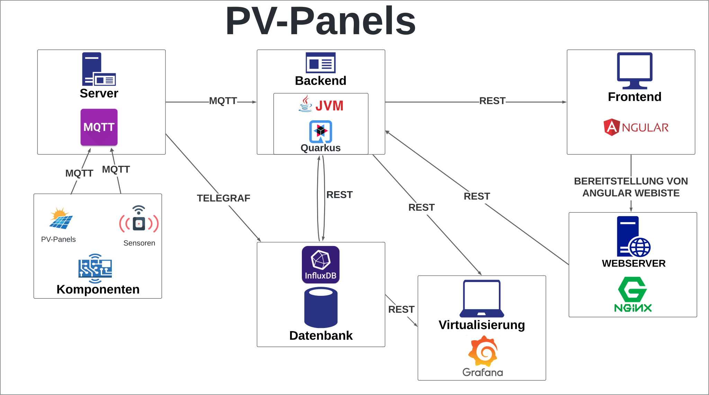
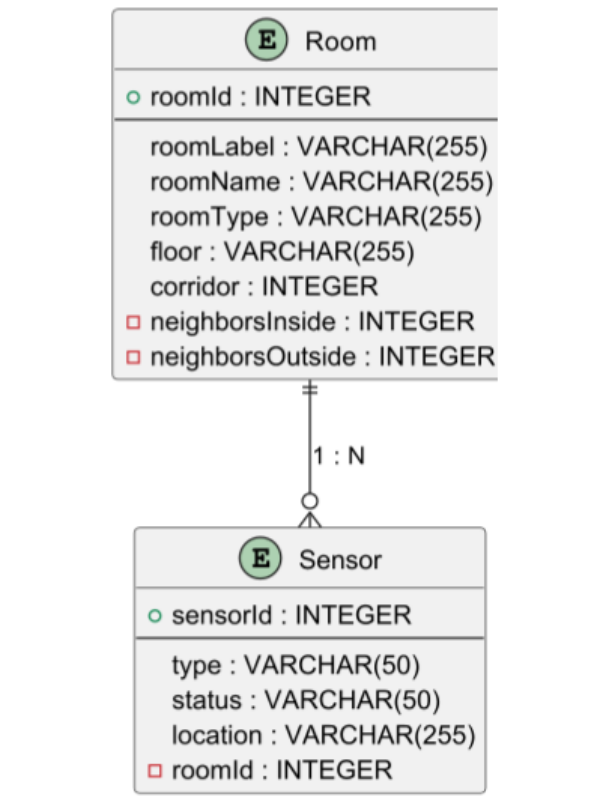

# 01-projekte-2025-4chif-syp-pv-panels

## Team
**Team**
| Name |
|------|
| Sebastian Radic |
| Tobias Kletsch |
| Denis Bjelak |
| Danis Mezildzic |
| Luis Schörgendorfer |

## Ausgangssituation
Auf einer VM (leoenergy genannt) werden von einem schuleigenen Server in einem 5-Minuten- Intervall per SFTP Datendateien im JSON-Format heruntergeladen.

## Anforderungen

- **Verarbeitung der Daten**:  
  Die Quarkus-App muss JSON-Dateien, die vom MQTT-Server bereitgestellt werden, einlesen, verarbeiten und mit korrektem Tagging in die InfluxDB schreiben. Dabei ist sicherzustellen, dass die Datenstruktur flexibel bleibt, um neue JSON-Dateitypen einfach hinzufügen zu können.

- **Visualisierung der Daten**:  
  Grafana muss eingerichtet werden, um die in der InfluxDB gespeicherten Daten auf übersichtlichen Dashboards zu visualisieren. Dies erfordert die Konfiguration von Queries und Panels, die eine klare Darstellung der Sensor- und Energiedaten ermöglichen.

- **Bereitstellung und Weiterleitung**:  
  NGINX muss so konfiguriert werden, dass:
  - Die Angular-Website als Benutzeroberfläche bereitgestellt wird.
  - API-Anfragen des Frontends sicher an die Quarkus-App weitergeleitet werden, um eine zuverlässige Kommunikation zwischen Frontend und Backend sicherzustellen.

Das System muss modular aufgebaut sein, um zukünftige Erweiterungen wie neue Sensordaten oder JSON-Typen einfach integrieren zu können.

## Endergebnis
Am Ende des Projekts wird ein vollständig funktionsfähiges System entstehen, das die Schule dabei unterstützt, den Energieverbrauch effizient zu überwachen und zu verwalten. Außerdem planen wir, das Projekt so weit zu entwickeln, dass es problemlos auf der Schulwebsite integriert und genutzt werden kann.

## Diagrams

**System Architecture**  

**ERD**  

## Sprint-Backlog
[Sprint Backlog](https://vm81.htl-leonding.ac.at/agiles/99-404/100-1841)

