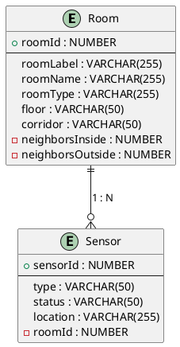

# 01-projekte-2025-4chif-syp-pv-panels

## Team
**Team**
| Name |
|------|
| Sebastian Radic |
| Tobias Kletsch |
| Denis Bjelak |
| Danis Mezildzic |
| Luis Schörgendorfer |

## Ausgangssituation
Auf einer VM (leoenergy genannt) werden von einem schuleigenen Server in einem 5-Minuten- Intervall per SFTP Datendateien im JSON-Format heruntergeladen.

## Anforderungen
Die Quarkus App liest diese JSON-Dateien ein und schreibt diese in eine InfluxDB. Dabei ist auf korrektes Tagging zu achten. Es werden laufend neue JSON-Dateitypen hinzugefügt.

## Diagrams

**System Architecture**  

**ERD**  

## Sprint-Backlog
[Sprint Backlog](https://vm81.htl-leonding.ac.at/agiles/99-404/100-1841)

